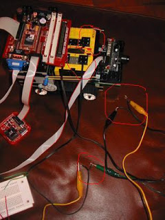
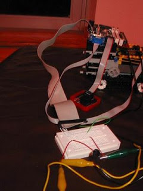

# Cisim Takip Eden Robot - JStamp, CmuCam ve Lego

Cisim Takip Eden Robot - JStamp, CmuCam ve Lego

Daha önceki yazılarda bahsettiğimiz teknolojileri, şimdi biraraya koyacağız. Amacımız, CmuCam gözü ile görünen cisimleri, hareket edince takip etmek, ve bu veriye göre robot tekerleklerini çevirip peşinden izletmek.   

 
  
  
 İlk önce elimizdeki teknolojileri gözden geçirelim.  

 
  
  
 
 * CmuCam, seri port üzerinden cisim takip verisi aktarabiliyor. 
 * JStamp üzerinde seri port girişleri var. JavaComm arayüzleri kullanarak, bu portlardan veri almak mümkün. 
 * Tekerlek kontrolünün Lego kontrolunde olması lâzım. LeJos Java teknolojisi kullanarak teker kontrolü yapacağız.  
 * Lego ve JStamp arasındaki bağlantı, Lego 'algı sistemi' kullanarak olacak. Lego motorlarina JStamp'den bağlanmak imkansız, çünkü JStamp'ten çıkan voltaj miktarı Lego motorları için yetmiyor. 
 * JStamp üzerinden motor aç/kapat sinyalleri, GPIO pinleri denen pinlerden alınacak. Bu pinler üzerinde +3V ve 0V voltaj değerlerini, Java kodu kullanarak yaratmak mümkün. Bu çıkışları, Lego algı girişlerine bağlamamız lazım. 

 
  
  
 Bütün bu bağlantılar yapılınca, elimize aşağıdaki gibi bir sistem çıkacak.   

 
  
  
   

 
  
  
 Şimdi teknik detaylara gelelim. Bahsettiğimiz bütün Java bu yazinin altinda bulabilirsiniz. 

 
  
 CmuCam - Cisim Takip Verileri 
  
  
 CmuCam özelliklerinden birisi, cisim takip et komutuna direk destek vermesidir. Cisim takip komutu, MM\r ve TW\r baytlarının seri port üzerinden kameraya göndermek ile olacak. Bu programı Tracker.java dosyasında bulabilirsiniz.    

 
  
  
 Cisim takip komutunu JStamp vermeli. JStamp ile kamera bağlantısı ekteki resimde gösteriliyor.  

 
  
  
   

 
  
  
 JStamp üzerinde iki port var, biri com1 oteki com2 olarak belirtilmiş. Tracker.java programının kullandığı aynı porta bağlantı yapmayı unutmayın. Tracker programı, JStamp üzerinde işletilecek.  

 
  
  
 Kameraya komutlar verildikten sonra, Java okuyucu programı ile X ve Y değerlerini sürekli olarak almanız lazım. Tracker.start işleminde gördüğünüz while(true) döngüsü, seri porttan sürekli bir şekilde bu verileri devreye indirecek. Bahsettiğimiz veriler, M harfinden sonra gelen 8 tane sayı ile simgelenmiştir. Eger kamera önündeki cisim yerini değiştirse, koordinatların M harfinden hemen sonra gelen X ve Y değerlerinin de değiştiğini göreceksiniz.    

 
  
  
 JStamp devresi bu aldığı X ve Y bilgileri şu şekilde kullanır. Kamera'nın ilk gördüğü, yani JStamp'e aktarılan ilk X ve Y değerleri 'baslangıç' olarak farzedilir. Bundan sonraki X değerinde, sağ ya da sol yönde 5 sayısından fazla bir değişim var ise, JStamp robota 'o tarafa doğru dön' komutu vermesi lazımdır. Bu hesabın örneğini, CoordControl.java nesnesi altında bulabilirsiniz.  

 
  
 JStamp - Lego motor kontrolu 
  
  
 Sağ ya xda sola dönme kararı verildikten sonra, bu komutun Lego'ya iletilmesi gerekir. Daha önce, bu "donanım arayüzü" olarak Lego algılarının kullanılacağını anlatmıştım. Kablo bağlantılarının ornegini asagidaki resimde bulabilirsiniz.  

 
  
  
   

 
  
  
 Kırmızı ile işaretlenen noktalar, Lego algılarına nasıl bağlancağımızı gösteriyor. Görülen iki Siyah kablo, Lego seti ile  beraber geldi... Bu kablo aslında bir uzatma kablosudur, fakat bu proje için ortasindan kestik, ve uçları bağlantı yapmak için açtık.  

 
  
  
 Resmin sol-alt köşesinde gördüğünüz, elektronikte breadboard (işlem tahtası) denen bir araçtır. Devreleri çabucak kurmak için cok rahat bir ortamdır. Üzerinde devre parçalarının girebileceği şekilde delikler var, ve yatay noktalar birbirine bağlı. Her iki yandaki dikey noktalarda birbirine bağlı, yanlardaki noktalar genelde (-) ya da "toprak" baglantısı için kullanilir.  

 
  
  
 İşlem tahtasından çıkan kabloları, JStamp devresine bağlamak için, bir sabit disk (hard disk) kablosu kullandık. Sebep: Sabit disk kablosunun uçları JStamp üzerindeki pinlere çok güzel uyuyor. Bu kablonun ucu JStamp icin basta biraz büyük geldi, o yüzden bir kısmını kesip attık. Bu örnek bağlantıyı aşagıda göreceksiniz.    

 
  
  
   

 
  
  
 Bağlantılar bitti.. Şimdi motor bağlantısını Java kodu ile nasıl yapıldığını görelim.  

 
  
 Motor Kontrol Yazilimi 
  
  
 Motor kontrolü icin, 2 ayri yerde, 2 türlü Java kodu yazmamız gerekti. İlki JStamp üzerinden GPIOA_BIT4 ve GPIOC_BIT6 pinlerinde '1' ve '0' değerleri yaratmak için. Bu pinlerden biri sola dön (Lego A motoru) öteki sağa dön (Lego B motoru) için kullanıldı.  

 
  
  
 Fakat daha önce bahsettiğimiz gibi, bu pinleri direk olarak Lego motorlarına bağlamamız mümkun değildi. Voltaj uyuşmazlığı problemimizden bahsetmiştik. Buna çare olarak, bağlantıları algılara yaptık. Çünkü algılar dış voltajlara dayanıklı, ve +3V ve +5V gibi voltajlar ile rahat calışan ortamlar idi. Tabii ki algılar aç/kapa gibi işlemler için gerektiği için, yüzden yüksek voltaj gerektirmemişlerdir.  

 
  
  
 Bu değerleri Lego'da okumak için, öyle bir kod yazmamız lazım ki, algılardan gelen sinyalleri alsın, eğer artı değerde voltaj görürse, kendi motorlarını kendi çevirsin. lejos/ dizini altındaki Test.java dosyasının yaptığı budur. Sonsuz döngü içinde 1 ve 2 nolu algılardan Sensor.S1.readValue() ve s2 = Sensor.S3.readValue() işlemleri ile değerleri sürekli okur. Değer farkederse motorları çevirmeye başlar.  

 
  
  
 Biz tabii test olarak, devreyi birleştirmeden önce, test için JStamp'ten sinyal vererek, Lego uzerinde çıkan değeri ölçmüştük. Çıkan değer 600 civarındadır.. O yüzden karar döngümüz aşağıdaki gibi kurduk.   

 
  
  
  
..
..
while(true) {

    s1 = Sensor.S1.readValue();
    s2 = Sensor.S3.readValue(); 
    try{Thread.sleep(160);}catch(Exception e){}

    LCD.showNumber(s1);

    if (s1 > 500) { // sola don
        Motor.A.backward();
    }
    else if (s2 > 500) { // saga don
        // no-op
    }
    else { // yoksa ileri devam
        Motor.A.forward();
    }
}
..
..
 

 
  
  
 İşte bu kadar. Lego ve JStamp üzerine kod yüklemeyi bu yazıda işlemedik, o konudan ayrı yerlerde bahsedeceğiz. Bu yazının ve projenin amacı, yüksek işlem hızı olan bir robot ortamı yaratmak idi. JStamp aj-80 hızı, Lego RCX içindeki çipten cok daha yüksektir. Ayrıca JStamp üzerindeki 1MB'a varan hafıza, RCX üzerindeki 30 KB ile karşılaştırılınca farklar ortaya çıkıyor.    

 
  
  
 Kurduğumuz bu ortam, bize daha ilerde işleyecegimiz Robot Göz projeleri için yardımcı olacak. Görüntü verisi işlemek yüksek hafıza ve işlemci gücü gerektirebilir; bu duruma hazır olmak için aj-80 bazlı bir robot kurmamız işimize yarayacak.  

 
  
  
 Türkiye'de LEGO Mindstorm temini için  
Adore Oyuncak
Maslak/İstanbul

Tel: 212 286 0748 / 0765
e-mektup adresi: yurur@adoreoyuncak.com

Controller.java

package camera;

public class Controller
{

  protected static String STATE_FIND_OBJECT = "F";
  protected static String STATE_NEW_LOCATION_DETECTED = "N";
  protected static String TURNING_WHEELS = "T";

  protected String state;

  public Controller() {
    state = STATE_FIND_OBJECT;
  }

  void handleTrackingData(byte x, byte y) {
  
    if (state.equals(STATE_FIND_OBJECT)) {
    
    }
    else if (state.equals(STATE_NEW_LOCATION_DETECTED)) {
    
    }
  
    else if (state.equals(TURNING_WHEELS)) {
    
    }
      
  }

}

CoordControl.java

package camera;

public class CoordControl

{

    protected int currentX = 0;

    protected Robot robot = new Robot();

    public CoordControl() {

    }

    public boolean getIsMiddleMassSet() {

        if (currentX == 0) return false;

        else return true;

    }

    void setMiddleMassCoord(int x, int y)

    {

        currentX = x;

        System.out.println("MM is set: " + x);

    }

    void handleTrackingData(int x, int y) {

        if (x - currentX > 3) {

            turnLeftWheel();

        }

        if (currentX - x > 3) {

            turnRightWheel();

        }

    }

    public void turnRightWheel() {

        System.out.println("Turning to right..");

        robot.turnRight();

    }

    public void turnLeftWheel() {

        System.out.println("Turning to left..");

        robot.turnLeft();

    }

}

Robot.java

package camera;

import com.ajile.drivers.gpio.GpioPin;

import com.ajile.drivers.gpio.GpioField;

public class Robot

{

    GpioPin motor1;

    GpioPin motor2;

    Robot()

    {

        motor1 = new GpioPin(GpioPin.GPIOA_BIT4);

        motor1.setOutputPin(true);        

        motor2 = new GpioPin(GpioPin.GPIOC_BIT6);

        motor2.setOutputPin(true);

    }

    

    public void turnRight()

    {

        motor1.setPinState(true);

        motor2.setPinState(false);

    }

    public void turnLeft()

    {

        motor1.setPinState(false);

        motor2.setPinState(true);

    }

    

}

    

Tracker.java

// Simply sets the camera in middle mass mode, and tracking the first

// color it sees. All tracking data is displayed on the screen.

// It does not use event handler, it simply gets into infinite loop.

package camera;

import java.io.IOException;

import java.io.OutputStream;

import java.io.InputStream;

import java.io.*;

import javax.comm.SerialPort;

import javax.comm.SerialPortEvent;

import javax.comm.CommPortIdentifier;

public class Tracker {

    protected InputStream inStream;

    protected OutputStream outStream;

    protected CoordControl coords = new CoordControl();

    public  static void main (String [] args) {

        Tracker t = new Tracker();

        t.start();

    } // end main

    public void start() {

        try {

            initializeSerialPort();

            // middle mass mode

            sendMessage("MM 1\r");

            try { Thread.sleep(1000); } catch(InterruptedException e){}

            // read ACK

            while(inStream.available() > 0) {

                byte rcvVal = (byte) inStream.read(); // blocking call

                System.out.println((char)rcvVal);

            } // end while

            // Tracker first object seen

            sendMessage("TW\r");

            try { Thread.sleep(1000); } catch(InterruptedException e){}

            // display coordinates (M packet in the manual)

            System.out.println("Reading MM data");

            byte rcvVal;

            while (true) {

                rcvVal = (byte) inStream.read();

                //System.out.println(">" + (char)rcvVal);

                if ((char)rcvVal == 'M') {

                    inStream.read(); // junk

                    StringBuffer x = new StringBuffer();

                    x.append((char) inStream.read());

                    //System.out.println("$" + x);

                    x.append((char) inStream.read());

                    System.out.println("$" + x);

                    if (coords.getIsMiddleMassSet() == false)

                    {

                        coords.setMiddleMassCoord(Integer.parseInt(x.toString()), 0);

                    }

                    else

                    {

                        coords.handleTrackingData(Integer.parseInt(x.toString()), 0);

                    }

                    for (int i = 0; i<14; i++)

                    {

                        // junk the rest

                        rcvVal = (byte) inStream.read();

                        //System.out.print("=" + (char)rcvVal);

                    }

                }

            } // end while

        } catch (java.io.IOException ioe) {

            System.out.println("Error: IOException");

            System.exit(1);

        } // end catch block

    }

    public void sendMessage(String msgString) {

        try {

            outStream.write(msgString.getBytes());

        } catch (IOException ioe) {

            System.out.println("IOException caught in Track.sendMessage");

        }

    }

    public void initializeSerialPort() {

        SerialPort serialPort;

        CommPortIdentifier commPortId;

        try {

            System.out.println("before");

            commPortId = CommPortIdentifier.getPortIdentifier("com2");

            System.out.println("before");

            if (!commPortId.isCurrentlyOwned()) {

                if (commPortId.getPortType() == CommPortIdentifier.PORT_SERIAL) {

                    try {

                        System.out.println("opening port...");

                        serialPort = (SerialPort) commPortId.open("SerialListener",0);

                        System.out.println("opened");

                        serialPort.setSerialPortParams(115200,

                            javax.comm.SerialPort.DATABITS_8,

                            javax.comm.SerialPort.STOPBITS_1,

                            javax.comm.SerialPort.PARITY_NONE);

                        System.out.println("params set..");

                        // Get output and input streams

                        outStream = serialPort.getOutputStream();

                        inStream = serialPort.getInputStream();

                    } catch (javax.comm.UnsupportedCommOperationException ucoe) {

                        System.out.println("Error: UnsupportedCommOperationException");

                        System.exit(1);

                    } catch (javax.comm.PortInUseException piue) {

                        System.out.println("Error: PortInUseException");

                        System.exit(1);

                    } catch (java.io.IOException ioe) {

                        System.out.println("Error: IOException");

                        System.exit(1);

                    } // end catch block

                } else {

                    System.out.println("Error: comm port is not a serial port");

                    System.exit(1);

                } // end if port is serial

            } //  end if port is not owned

        } catch (javax.comm.NoSuchPortException nsp) {

            System.out.println("NoSuchPortException");

            System.exit(1);

        }

        System.out.println("exiting method..");

    } // end initializeSerialPort

} // end  Track

Makefile

LEJOSHOME = c:/lejos

LEJOSC = $(LEJOSHOME)/bin/lejosc

LEJOS = $(LEJOSHOME)/bin/lejos

EMULEJOS = $(LEJOSHOME)/bin/emu-lejos

LEJOSRUN = $(LEJOSHOME)/bin/lejosrun

EMULEJOSRUN = $(LEJOSHOME)/bin/emu-lejosrun

LEJOSFIRMDL = $(LEJOSHOME)/bin/lejosfirmdl

CLASSPATH = .

CLASSLIB = $(LEJOSHOME)/lib/classes.jar

SOURCES = Test.java

OBJECTS = Test.class

PROGRAMS = Test

BINARY = Test.bin

EMUBINARY = Test.emu

SIGNATURE = Test.sig

.EXPORT_ALL_VARIABLES :

.PHONY : run

default : run

run : $(BINARY)

 $(LEJOSRUN) $(BINARY)

emulate : $(EMUBINARY)

 $(EMULEJOSRUN) $(EMUBINARY)

firmdl :

 $(LEJOSFIRMDL)

$(BINARY) : $(OBJECTS)

 $(LEJOS) -verbose $(PROGRAMS) -o $(BINARY) > $(SIGNATURE)

$(EMUBINARY) : $(OBJECTS)

 $(EMULEJOS) $(PROGRAMS) -o $(EMUBINARY)

$(OBJECTS) : $(SOURCES) $(CLASSLIB)

 $(LEJOSC) $(SOURCES)

clean :

 rm -f $(BINARY) $(SIGNATURE) *.class *~ core

Test.java

import josx.platform.rcx.*;

class Test extends Thread implements SensorConstants {

    public Test() {

        Sensor.S1.setTypeAndMode(

            SensorConstants.SENSOR_TYPE_RAW,

            SensorConstants.SENSOR_MODE_RAW);

        Sensor.S1.activate();

        Sensor.S3.setTypeAndMode(

            SensorConstants.SENSOR_TYPE_RAW,

            SensorConstants.SENSOR_MODE_RAW);

        Sensor.S3.activate();

        this.start();

    }

    public void run() {

        int s1;

        int s2;

        while(true) {

            s1 = Sensor.S1.readValue();

            s2 = Sensor.S3.readValue();

            try{Thread.sleep(160);}catch(Exception e){}

            LCD.showNumber(s1);

            if (s1 > 500) { // turn left

                Motor.A.backward();

            }

            else if (s2 > 500) { // turn right

                // no-op

            }

            else { // othwewise, move ahead

                Motor.A.forward();

            }

        }

    }

    public static void main(String [] args) {

        new Test();

    }

}

