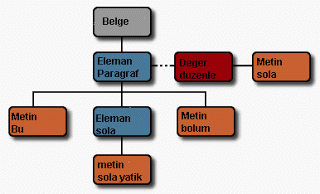

# DOM ve XPATH kullarak XML işlemek

DOM ve XPATH kullarak XML işlemek

 DOM belge işleme yöntemi, W3C kurumu tarafından kabul edilmiş dil, sonuç ortamından bağımsız bir belge işleme standartıdır. DOM, bir XML belgesini temsil edebilecek arayüzler tanımlar, ve bu arayüzler içindeki işlemler XML dosyalarındaki elemanlara erişim ve değiştirme gibi hizmetler sağlar. DOM oldukça yaygın destek görüyor ve birçok programlama dili üzerinde kodlanmış halde: Java, Perl, C, C++, Tcl ve Phyton.                Bu yazıda gösterecegimiz üzere DOM, akım temelli XML işlem yöntemleri yeterli olmadığı durumlarda (mesela SAX gibi) çok yararlı olacak. Akım temelli yöntemlerden kastımız, XML dosyasındaki elemanları teker teker işleyen, bütün belgeyi 'görmeyen' türden yöntemler. DOM bütün XML dosyasını hafızada ağaç veri yapısı kullanarak tutabilir.              Ne yazik ki, DOM tarifnâmesinin dilden-bağımsız bölümleri, ve XML belgesini soyutlayarak temsil etmek için öngördüğü 'herşey bir ağaç yapısında ki düğüm noktasıdır" gibi kavramları yanlış yapmayı daha rahat hale getiriyor, ve kullanan kodun yapısındaki aksaklıkları teşvik ediyor. Geçmişte DOM kullanan projelerimizin kodlarına baktığımızda bunu berrak olarak gördük. Bu genel problemleri çözümleri ile burada aktaracağız.           Belge Nesne Modeli (DOM)           DOM'a göre XML dosyasının her yeri bir düğüm noktasıdır, ve bu noktalar içindeki bilgiler 'çeşit' bilgisi ve 'değer' bilgisi olarak bilinir. Mesela ekteki XML parçasına bakalım.               <paragraf duzenle="sola">Bu<it>sola yatık</it>bölüm.</paragraf>              Yukaridaki XML dosya parçası, aşağıdaki görüntü ile temsil edilebilir.                             Belge, Eleman, Metin ve Deger olarak tanımlanan parçalar DOM düğüm noktasıdır.              Fakat bu zarif tanım, bazı sorunları beraberinde getiriyor. Mesela ekteki XML parçasını düşünün.  Deger . Sanırsınız ki,   'Deger' diye gösterilen metin, Java String nesnesi ile temsil edilecek, ve erişmek için, getDeger() gibi bir işlem yeterli olacak. Gerçekte, yukarıdaki metin bir Düğüm (Node) noktasıdır, ve başka bir dügüm noktası olan 'etiket-ismi' noktasının altında bulunur. (Çocuk düğüm olarak). Bunun yapılmasının DOM tasarımcıları tarafından mutlaka bazı sebebleri vardı: etiket-ismi altında bazen başka belge elemanları çocuk değerler olarak bulunabilirdi, bu gibi durumlarda metin değerini String olarak almak anlamsız olacaktı. Fakat, her şeyin dügüm noktası olarak görülmesi, sadece metin lazım olan (%80 ihtimalle) şartlar için programcılık hatalarını kolaylaştırmış oldu.           Tasarım Sorunları           DOM'ın dilden-bağımsız özelliğinin başka bir kötü yan etkisi de şudur: Her dilin kendine özgü benzer-oluşları mevcuttur, yani çok kez kullanılmış ve işlediği bilinen kullanım kalıpları. Ne yazık ki, DOM ortak bir dil için yazıldığı için, her dilin kendine hâs ve güçlü olan özellikleri DOM altında kullanılamıyor. Mesela, Element diye bilinen Eleman nesnesi bildiğimiz Java 'new' kelimesi ile yaratılamıyor, programcılar dış nesnelere (Factory diye bilinir yâni Fabrika) Element nesnesini yarattırmak zorunda kalıyorlar. Düğüm listeleri (çocuk düğümler örneğinde gördügümüz gibi) NodeList nesnesi içinde bulunuyor, fakat bütün Java programlarımızda java.util.List ve java.util.Iterator nesnelerini kullanmaya alışığız. Böyle ufak değişiklikler, toplana toplana karşımıza acaip kodlama yöntemleri ve kod fazlalığı olarak çıkıyor, ve programcıları 'DOM-nevi kodlamayı öğrenmeye; mecbur bırakıyor; hâlbuki Java-nevi kodlabilsek işimiz daha rahat olacak.               DOM tasarımına göre, herşey bir Dügümdür (Node). Bu yüzden neredeyse her XML değeri, meselâ Belge (Document), Eleman (Element) ve Değer (Attr) Düğüm denen Node arayüzünü uzatıyor. Tasarım olarak gayet muntazam olan bu yöntem sayesinde, her DOM gerçekleştirmesi kendi nesnelerini kendileri kodlayarak, ara nesnelerden geçmeden arayüzleri kullanıcıya açık bırakabiliyor.               'Herşey bir düğümdür' tasarımının problemi elimizde olan Düğüm çesitlerinin fazlalığı, ve bu dügüm noktalarına erişirken birörnek olmayan yöntemler. Mesela insertData yöntemi CharacterData düğümlerinin değerini vermek için kullanılıyor, fakat Attr düğümleri için setValue yöntemi kullanılıyor! Değişik düğümler için değişik arayüzler kullanınca nesnesel tasarımda önemli olan birbiçimlik kalmıyor, herşeyi Düğüm yaparak kazandığımız muntazamlığı kaybediyoruz. Çünkü programcıların öğrenim eğrisi yükseliyor.           JDOM          JDOM kütüphanesi, bahsettiğimiz problemlere çözüm olarak yazıldı. DOM'un dilden-bağımsız problemlerini çözerek DOM'a daha bir Java-nevi erişim şekli kazandırmaya çalıştı. Ve çok tekrar edilen kullanım yöntemleri için kestirme metodlar ve işlemler kazandırmaya uğraştı. JDOM'a göre her düğüm değişik bir nesnedir (Belge, Eleman ve Değer gibi), bu sayede programcılar 'new' kelimesini kullanıp Düğüm yaratabiliyorlar, ikidebir dönüşüm (cast) yapmalarına gerek kalmıyor. JDOM altında Java List ve Iterator kullanılıyor.           Genel kodlama hâtaları      Kod fazlalığı          Ufak şeyleri yapmak için fazla kod gerekiyor. Mesela, bir Attr düğümünün değerini kontrol etmek için 16 satır kod yazıldığını gördük. Bu tip şeyleri yapmak için 3 satırlık kod yetmeli. Tabii DOM'un soyutluk seviyesinin çok altta olması, yanlış bilinen kodlama teknikleri de bu problemi arttırdı.           DOM'u Dolaşmak          Baktığımız proje kodu içinde en çok yapılan işlem, DOM'u dolaşmak, ya da aramak idi. Ekte örnek bir kod görüyoruz. Bu kodda, 'baslik' adli bir dügüm noktasını belgeninin 'ayar' bölümünde arıyoruz.                Bu kod da yaptığımız, kök eleman ayarDugumu'nden başlıyarak, bu kökün ilk çocuğunu almak, ve bütün çocuklara teker teker bakmak. Gördüğümüz gibi, bayağı çetrefilli ve karmaşık bir kullanım, hata yapmaya çok açık.                Örnek olarak, ikinci satır getFirstChild (ilk çocuğu al) işlemi ile 'ayar' dügümünü getiriyor. Bu satırdaki problemlere bakalım. Aslında ilk çocuk dügümü aradığımız dügüm olmayabilir. Hiç kontrol etmeden ilk çocuğu alırsak, etiketin ismina aldırmamış oluyorum ve belgenin yanlış yerine sapmış olabiliyoruz. Çok başımıza gelen bir hata, mesela kök düğümünden sonra (enter) tuşu ile boş karakter ya da satırbaşı karakteri konulmuş ise olması; Bu durumda kökün altındaki ilk çocuk TEXT_NODE dügümü olur, aradığımız dügüm değil. Bunun deneyini siz de yapabilirsiniz; ornek.xml adlı dosyayı açip, örnek ve ayar etiket değerleri arasına bir satırbaşı koyun. Kodu işletince hata verip durduğunu göreceksiniz. Doğru işlem için bütün çocukları teker teker bakıp 'metin' olmayan türden olanını bulmam lazım.               Listing 1 altındaki kodun bir diğer problemi daha var. Eğer dosya yapısı beklediğimiz gibi değilse, mesela kök düğümün hiç çocuğu yok ise, ayarDugumu nesnesi null (boş) değeri taşıyacaktır, bu yüzden 3. satır hata mesajı verir. Bu yüzden kodun düzdün işlemesi için, hem dosyayı doğru gezmek için, hem her çocuk değerine teker teker bakmalıyım, hem de her işlemi çağırdığımda dönüş değerini kontrol etmeliyim. Değişik türden giriş verisini doğru işleyebilecek kod, detaya dikkat ve azami kod miktarı gerektirir.               Ve sonuçta, Listing 1'de gösterilen kod yerine tek bir getElementsByTagName adlı işlem yeterli olabilirdi, eğer programcı böyle bir arayüzün mevcut olduğunu bilse idi.           Etiket Altındaki Değeri Almak          Baktığımız projelerde, DOM dolaşımından sonra en çok ihtiyaç duyulan şey bir etiket altındaki değeri alıp getirmek olduğunu farkettik. Mesela elimizde Deger gibi bir dosya  olsun. 'herhangibiretiket' etiketine geldikten sonra (dolaşım yaparak) altındaki metni nasıl alırız?               DOM düzgün olsaydı, şunu yapmak yetebilirdi:  etiket.getData();              Tahmin edebileceğiniz üzere, yukarıdaki işlem istediğimizi yapmıyor. Esas metin, etiket düğümü altında 'çocuk dügüm' olarak durmakta. Yani işleyen kod şöyle olmalı:  etiket.getFirstChild().getData();              İkinci örnekte bile şunu görüyoruz: Aradığımız değer ilk çocuk düğümde olmayabilir. Birkaç alt düğümden sonra olabilir. Arada boşluk karakteri olabilir. Doğru çözüm için bütün çocuklara bakıp Node.TEXT_NODE tipinde olanları aramamız ve birleştirerek sonuç değerini oluşturmamız gerekiyor.              JDOM kütüphanesi bu sorunu tek bir işlem ile çözmüş: getText. DOM Seviye 3 kütüphanesi de bu soruna getTextContent işlemi ile cevap verecek. Alınacak ders: Üst düzey arayüzleri alt düzey arayüzlere tercih edin.           getElementsByTagName          DOM Seviye 2 kütüphanesi, verilen bir etiket isminden, o etiket altındaki bütün çocuk düğümleri geri getirebilen bir işlem sunmuş. Mesela,  NodeList isimler = birEleman.getElementsByTagName("isim");  birEleman altındaki 'isim' adlı düğümleri NodeList nesnesi (listesi) içinde getirecek. Bu yöntem daha önce tartıştığımız yöntemlerden muhakkak daha rahat.              Fakat bu yönteminde problemleri var.               Problem söyle: getElementsByTagName işlemi bütün dosyayı özyineli bir şekilde dolaşıyor, ve uyan bütün düğümleri getiriyor. Farzedin ki, bir XML belgesi içinde müşteri, şirket ve ürün bilgisi taşıyorsunuz. Bütün bu bilgi çeşitleri içinde 'isim' adlı bir etiket taşiyabilir. İsim kelimesi sık kullanılan bir kelimedir. Fakat bu yüzden ürün ismi ararken, müşteri ve şirket isimleri geri alabilirsiniz. İsim aramsını bir alt-ağaç altında işletebilirsiniz, fakat XML'in esnek yapısı dolayısı ile bulduğunuz alt-ağacın yapısının tahmin ettiğiniz yapı olduğunu bilebilmek gayet güç.           DOM'u Düzgün Kullanabilmenin Yolları         DOM'un tasarım eksikleri olduğuna göre, programlarımızı yanlışsız yazabilmek için bazı prensipleri aklımızda tutmamız yararlı olur.            Prensipler             * DOM'u belge içinde gezinti (traversal) için kullanma   * Mümkün olduğunca belge gezintisi veya direk dügüm erişimi için XPath kullanın.   * DOM'un üzerinde kurulmuş ve DOM'u kolaylaştıran daha yüksek seviyeli bir kütüphane kullanın.             DOM gezintisi, hem çok lazım olan, hem de problem yarabilen bir şey. O zaman, belgeyi DOM kullanmadan nasıl gezeriz?          XPath          XPath XML belgelerinin belli bölümlerini uyumlama ile bulabilen, eldeki adresi ile direk erişebilen, ve tüm dosyayı arayabilen bir dildir. W3C kurumunun tavsiye ettiği bir metoddur, ve çoğu programlama dili altında ve XML paketleri içinde mevcuttur. Büyük bir ihtimalle XML paketiniz XPath'i ya zaten ya da eklemeli bir şekilde destekliyor.               XPath, 'yol simgelemi' denilen bir yöntem kullanır; Dosya sistemleri ya da Internet adresleri de aynı simgelemi kullanıyor. Mesela XPath dilinde /x/y/z yolu, x kök düğüm altındaki y düğümünün altındaki z düğümünü arar. Bu yol kalıbına uyan bütün düğümler bulunup getirilecektir.               Daha çetrefilli uyumlarda mümkündür. Mesela /x/y/* gibi bir komut x adlı herhangi bir yerdeki dügümün altındaki bütün y düğümleri geri getirecektir. /x/y[@name='a'] gibi bir kullanım, a değerini taşıyan ve x dügümü altında olan bütün y dügümlerini geri getirir. Dikkat edilmesi gereken, XPath boşluk karakteri gibi olayları bizim için doğru şekilde tetkikleyip, geriye istediğimiz değerleri getirmesi. XPath'in A'dan Z'ye bütün konularını işlemek için yerimiz müsait değil, Kaynaklar bölümünde daha fazla XPath bilgisi alabileceğiniz yerler var. Tavsiyemiz, XPath öğrenmek için biraz vakit ayırırsanız, mükâfat olarak daha basit ve düzgün XML işlemleri elinize geçecek.           Kaynaklar          * DOM Tarifnâmesi   * Bu yazının örnek kodları. CLASSPATH'inize Xerces and Xalan eklemeyi unutmayın.   * Apache projesinden Xerces and Xalan DOM ve XPath paketlerini indirebilirsiniz.   * JDOM projesi   * XPath belgeleri             Bu yazı ilk önce IBM developerWorks sitesinde yayınlanmıştır.

