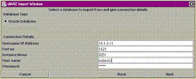

# DB Şemasının Grafiği

DB Şemasının Grafiği

 Veri tabanı şemaları ile çalışırken, özellikle daha önceden kurulmuş bir şemayı anlamaya uğraşırken, tabloları ve onların arasındaki ilişkileri (foreign key constraints) görsel olarak görebilmek büyük bir avantaj sağlar. Bunu yapacak olan araç, Oracle (ya da diğer bir) veri tabanına bağlanarak sözlük (dictionary) yapısını sorgulayacak, ve aldığı ilişki bilgilerine dayanarak çok rahat bir şekilde bir figür çizebilecektir.               Meselâ piyasadaki Erwin gibi bir araç, bir şemayı grafik olarak tasarlamaya bile izin vermektedir. Şema tasarımı grafik olarak yapıldıktan sonra, gerekli olan DDL (CREATE TABLE, ALTER TABLE) komutları araç tarafından bir metin dosyasına yazılabilmektedir. Bu komutlar Oracle komut satırı sqlplus üzerinden direk veri tabanı üzerinden çalıştırılabiliyor.               Bir tek problem var: O da Erwin'in ticari bir araç olması. Projemizin gerekleri için açık yazılım olan bir uygulamaya ihtiyacımız vardı, ve biz de dbViz adlı bir aracı bulduk. Projemizin ihtiyacı olan, mevcut şemayı grafik olarak göstermekten ibaretti ve dbViz tüm bu ihtiyaçlarımızı yeterli bir şekilde karşıladı.          Kullanım          dbViz'i başlattıktan sonra, "File | Import Schema | Import From Database" seçeneklerini takip edin. Bunlardan sonra aşağıdaki Oracle bağlantı bilgilerini isteyen bir kutu gelecektir.                             Bu bilgiler girildikten sonra, diyelim ki aşağıdaki gibi bir şemayı daha önceden sqlplus ile Oracle üzerinde yaratmış olalım:               -- A tablosuCREATE TABLE A(ANAHTAR  VARCHAR2(10),B_ANAHTAR  VARCHAR2(10),DEGER1  NUMERIC,DEGER2  NUMERIC);-- A'nin asal anahtariALTER TABLE A ADD CONSTRAINT pk_A PRIMARY KEY(ANAHTAR);-- B tablosuCREATE TABLE B(ANAHTAR  VARCHAR2(10),DEGER1  NUMERIC,DEGER2  NUMERIC);-- B'nin asal anahtariALTER TABLE B ADD CONSTRAINT pk_B PRIMARY KEY(ANAHTAR);-- A dan B'ye iliski (foreign key constraint)ALTER TABLE A ADD CONSTRAINT fk_A_DAN_B_YE FOREIGN KEY (B_ANAHTAR) REFERENCES B(ANAHTAR);              Bu şemanın grafik olarak çıktısı aşağıdaki gibi gösterilecektir.                             Dikkat edelim: Üstteki resimde, aracı kullanırken B kutusunun üzerine tıklamış olduğumuz gözüküyor. Bu kutuya tıklayınca B'ye ait olan kolon isimleri ve B tablosunun diğer tablolara olan bağlantılarının bir listesi gözüküyor (sol alttaki iki kutu). Listelenen her değerin yanındaki checkbox'u kullanarak grafik olarak neyin gözüktüğünü kontrol etmek bizim elimizde.           Kaynaklar          * DbViz Projesi   * Erwin

