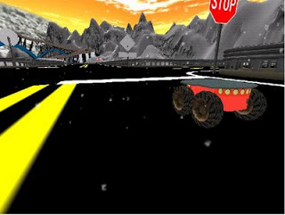
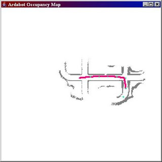

# Ardabot4j

Ardabot4j

Ardabot4j is an open source autonomous vehicle controller written in Java   created to work in the simulated environment USARSim. USARSim also aimed to   provide robot developers with basic sensor, visualization, mapping features   that sits on top of the popular game Unreal Tournament 2004 physical   engine.    
Ardabot4j project started as an assignment for Autonomous Robots   class. 

Ardabot4j is mainly written to work in DM-ARDA map which is a   facsimile of the DARPA Urban Challange environment. We installed   (soft-install, through a config file) a Tarantula 3D laser scanner which   supplied us 3D range data. We then applied vertical scanline detection   algorithm to define landmarks which in turn were used to map the   environment. Then, using this map, the bot was able to navigate its   environment. 

Ardabot4j features include a Driver UI which also lets the user drive manually, and lets user observe vertical scanline algorithm at work, real-time. User can toggle scanline visualization on and off using the c key. For manual driving, the keys are e for forward, x for stop, f for right steering and a for left steering. 

In Auto-Drive mode, Ardabot4j will take over control of the vehicle and start   identifying navigatable locations. These targets will be shown in   MapUI visually in green.  

Configuration
In order to install Ardabot4j, you must have Unreal Tournament 2004, USARSim and   DM-ARDA map installed. See this   documentation for more details. Then, in   UT2004\System\USARBot.ini file, you make following changes: 
[USARBot.RangeScanner3D]
MaxRange=1000.000000
ScanInterval=0.4
VerticalFOV=0.4363
VerticalResolution=0.0145
HorizontalFOV=1.0472
HorizontalResolution=0.0209
...
...
[USARBot.P2AT]
...
Sensors=(ItemClass=class'USARBot.RangeScanner3D',ItemName="TarantulaRangeScanner3D",
Position=(X=0.14399984,Y=0.0,Z=-0.0919999),Direction=(Y=0.1,Z=0.0,X=0.0))
Then, through Ant, you can fire up the UI using ant gui that will automatically connect to localhost port 3000. It is recommended you develop with UT/USARSim in server mode as seen below because gaming mode with full blown view (even when minimized) would eat up too much of your CPU processing power. 
ucc server DM-Arda_250?game=USARBot.USARDeathMatch?imeLimit=0?GameStats=False
-ini=USARSim.ini -log=usar_server.log

Downloads

USARSim   files including maps

Source

Music Video
Video 1
Video 2 

Bhosphorus University 

