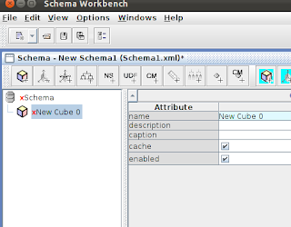
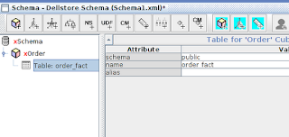
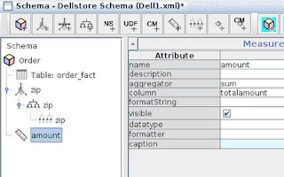

# Pentaho ile Ambar Tasarimi

Pentaho ile Ambar Tasarimi

Dellstore ornegi ile devam edelim. Ambar tablolari anormalize (denormalize) edilmisler tablolardir,  bir nevi "yassilastirilmis" haldedirler. Iliskisel tabanlarda veri tekrarina iyi gozle bakilmaz, fakat OLAP, yani ambar semalari bol bol veri tekrarlayabilir, ve bir suru tablodan aldigi veriyi tek bir tabloda ozetlemeye ugrasabilir.

Diyelim ki satislari analiz edecegiz, ve posta kodu (zip), satis miktari gibi bilgilerin tek tabloda olmasini istiyoruz. Iste ornek bir ETL,

drop table if exists order_fact;
create table order_fact as (
select 
o.orderid, 
o.customerid, 
o.totalamount, 
c.zip,
c.creditcardtype,c.gender, 
min(o.orderdate) over (partition by o.customerid ) as reg_date,
orderdate 
from orders o, customers c
where o.customerid = c.customerid
)

Bu tabloda onceki yazida gordugumuz "ilk alisveris" numarasi kullanildi, ayrica customers tablosundan cekilip alinmis posta kodu var. Boylece bir Gercek (Fact) olusturduk. min() ve diger tablolardan veri cekerek Gercek tablosunu zenginlestirdik, ona daha fazla aninda erisilebilecek bilgi kazandirmis olduk. Kimbilir bu ek bilgileri ne sekillerde kullanacagiz (sonraki yazi).  

Ambari tasarlamak icin Pentaho Schema Workbench gerekli,

http://sourceforge.net/projects/mondrian/files/schema%20workbench/

Acildiktan sonra dizin icinde sh workbench.sh isletmek yeterli. File | New | Schema ile yeni semayi tasarlamaya baslayabilirsiniz.

Once Options | Connection ile yeni bir taban baglantisi tanimlayin.

Simdi sol ust kosede Schema uzerine sag tik ile Add Cube. Bir kup (cube) aslinda Gercek kavramina tekabul ediyor.

Ilk ekleme yapildiginda kirmizi ile isaretli olacak, bu bir uyari, Schema Workbench (SW) surekli kupun tasarimini kontrol ediyor ve uygun degilse o kisimlari kirmizi ile isaretliyor. Isim degisikliginden sonra, Order kupu uzerinde Add Table secebilirsiniz.

Tablo eklemek icin schema secilmesi gerekir, bunlar bir listeden gosterilecek zaten, sonra name icin tablo secilir. Bu da listede var.

Sonra kup uzerinde Add Dimension. Bu otomatik olarak boyut (dimension) altina bir hiyerarsi (hierarchy) ekleyecek. Simdi hangi tabloya referans ettiginiz gerekli, yani Gercek ve Boyut arasindaki baglanti burada yapilacak.

Burada bir ara verip boyut kavramini bir daha dusunelim. Aslinda her boyutun ayri bir tablo olmasina gerek yoktur. Bazi boyutlar Gercek uzerinde basit kolonlar olarak dururlar, mesela sehir ismi, posta kodu boyle olabilir. Bu tur basit bilgiler icin uzerinde sadece iki tane kolon olan (bir id, bir de deger) bir tablo gereksiz olur.Bu tur boyutlara bu sebeple dejenere boyut (degenerate dimension) adi verilir, bir tur "dandik boyut (!)" denebilir. Pentaho'ya bir boyutun dejenere oldugunu belli edebilirsiniz. 

Yani bu noktada aracta Add Table ile tablo eklemek gerekir, ki bunu yapacagiz, ama sonra bir seviye (level) eklemek gerekir, ama biz bu seviyeyi ekleyince, tabloyu silecegiz. Level uzerinde kolon (column) icin eger order_fact uzerindeki bir kolon ismini verirseniz, ve boyut tablosu yoksa (ki yok,  cunku sildik), Pentaho bunun dejenere boyut oldugunu anlar. Daha duzgun isimler de verdikten sonra durum soyle

Column icin liste cikmiyorsa onemli degil, elle kolon ismini yazin. Simdi kup uzerinde Add Measure diyerek bir olcut ekleyelim. Bu olcut Pentaho ambar arayuzu ile boyutlarin detayina girerken (drill down) gosterilecek olcut. 

Simdi File | Publish ile bu tasarimi ana servise yayinlayabiliriz. Altta gorulen ekran geliyor, Publish Password onceki yazidaki xml icinde olan sifre. Kullanici vs biliniyor zaten. 

OK deyince ikinci bir ekran gelecek.

Bu ekranda Data Source icin dell girdik. Bu ismin Pentaho konsolunda onceden yaratilmis bir veri taban baglanti ismiyle birebir uyusmasi lazim. Simdi Publish ile yayini yapin. Simdi konsola gidelim, ve New Analysis View ikonuna tiklayalim,

Bir dialog kutusu gelecek, burada Dellstore Schema ve Cube icin Order sececegiz, yani yaptigimiz yayin basarili olmus ki bizim kup konsol tarafindan goruluyor. Secince analiz sayfasina girecegiz,

Bu noktada zip altindaki + isaretini tiklarsak,

Hangi posta kodundan gelen musterilerin toplam kac liralik alim yaptigini gorebiliriz.

Dahasi da var tabii; tek boyut, tek gercek ekledik. Eger birden fazla boyut olsa, Pentaho boyutlarin birbiri altinda dallanip budaklanmis bir halde nasil dagilabilecegini gosterecekti. Ayni anda birden fazla olcut (measure) gosterebilirdik, vs. Bunlar da baska bir yazinin konusu olsun. 

Kupu File | Save ile kaydettikten sonra kaydedilen dosyanin icine bakin, bu bir XML dosyasi, ve cok rahat okunabilen bir formati var. Bir boyutu ekleyince, digerlerini bir editor icinden kopyala yapistir yapip birkac isim degisikligi ile hizla ekleyebilirsiniz. 

