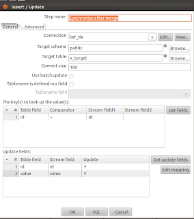
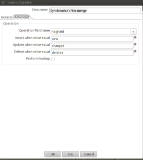

# Pentaho ile Tablolari Senkronize Etmek

Pentaho ile Tablolari Senkronize Etmek

Veri ambarlarini olusturan ETL isleminin onemli bir kismi ham verinin bir noktadan bir noktaya aktarilmasidir. Cogunlukla kaynak veri ambara "yakin" bir taban uzerinde bir ara bolgeye (staging) alinir, ve bu ara bolgedeki veri, kaynagin birebir kopyasi olmalidir.

Peki bu ara bolgeye sadece "degisen" verilerin alinmasi daha iyi olmaz miydi? Boylece tum kaynak verisinin tamamini, surekli almak zorunda kalmazdik.

Pentaho Data Entegrasyon (PDI) araci boyle bir ozelligi sagliyor.

Once ornek veri 

create table x_target( id text,  value text );create table x_source ( id text, value text);truncate table x_source;insert into x_source values('1','111');insert into x_source values('2','222');insert into x_source values('3','333');insert into x_source values('4','444');insert into x_source values('5','555');

Iki tane tablo yarattik, biri kaynak (source), digeri hedef (target). Amacimiz hedefi kaynak ile surekli birebir ayni tutmak ve guncelleme isleminin sadece farklari almasi. Farklar ne olabilir? ETL genellikle geceleri isletilen islemlerdir, diyelim ki onceki gece ETL isleyip bittikten sonra  kaynaga eklenen yeni verileri alacagiz. Ya da mevcut kayitlarin bazilari guncellenmis olabilir onlari alacagiz, ya da son olarak kaynakta bazi silme islemleri yapilmis olabilir, bu silme islemlerini aynen biz de ara bolgede yapmaliyiz.

PDI ile bu islemi soyle yapariz.

Dort tane gorsel ogeye ihtiyacimiz var. Oncelikle iki tabloyu kaynak olarak tanimlamayi saglayan  Input | Table input ogesi. Bu ogeyi iki kere ekliyoruz, biri kaynak digeri hedef icin. Kaynak icin mesela "Table input source" tanim olarak veriyoruz, hangi veri tabanina baglanilmasi gerektigini "Connection" ile tanimliyoruz, ve verinin hangi SQL komutu ile alinacagini belirtiyoruz. En basiti SELECT * FROM tanimi kullanmak. 

Simdi bu iki tablonun farkinin bulunmasina / yaratilmasina / alinmasina gelelim. Joins | Merge Rows (diff) ogesini kullanalim. 

Bu ogeye hedef tablosu (Table input ogesi olarak) "Reference rows origin" olarak, kaynak ise "Compare rows origin" olarak veriliyor, hemen bir liste uzerinden secilebilir haldeler, cunku Kettle GUI'si icinde oklarla baglantiyi yapmistik. Flag fieldname ise bu karsilastirma, birlestirme (merge) isleminin ek olarak kendi yarattigi yeni bir kolon. Bir hayali kolon denebilir. Bu kolona ismini biz veriyoruz, basit olarak "flagfield" ismini verdik. Bu kolon, karsilastirma islemi sonrasi her farkli satir icin yeni (new), degisti (changed), ve silindi (deleted) bilgisini  ekleyecektir, boylece bir sonraki basamagin bu bilgi ile gerekli islemi yapmasini saglayacaktir. 

Bu karsilastirma tabii ki her iki tarafta birbirine uyan satirlar uzerinde yapilacaktir, yani mesela guncellenme kontrolu icin ID'si iki tarafta ayni olan satirlara bakilacaktir. Bu sebeple Merge islemine bu ID kolonunun hangisi oldugu soylenmeli. "Keys to match" ile bu tanimlanir. Sonra, bu ayni ID'ye sahip satirlarda hangi degerlerin degisip degismediginin kontrolunu de "Values to compare" ile tanimlariz. Bu kolon isimlerini elle haldur huldur yazmaya gerek yok bu arada, en alttaki "Get key fields" ve "Get value fields" dugmeleri otomatik olarak tum listeyi alir, sonra arasindan istenmeyen kolonlar silinebilir.

Ozet olarak Merge islemi sadece farkli olan satirlari bulur, ve hayali bir kolon da ekleyerek bir sonraki basamaga aktarir.

En son islem "birlestirme sonrasi senkronize (syncronize after merge)". Bu oge birlestirmeden gelen veriyi aliyor, ve eklenen hayali kolon uzerinden farkli satirlarla gerekeni yapiyor.

Senkronizasyon icin hedef tablosu tanimlaniyor, taban baglantisi veriliyor. Yine ID tanimi var, ama bu sefer birlestirme isleminden gelen veri akintisinin (stream) icindeki ID ismi. Gerci farketmiyor cunku hep ayni isim kullandik, "id" kolonu. Bu kolon, hedef tablosundaki yine "id" isimli kolona uyduruluyor. Hangi kolonlarin guncellenecegi Update fields ile tanimli.

Advanced tab'i uzerinde birlestirmeden gelen hayali kolonun ismi tanimlanir, flagfield demistik onu veriyoruz, ve hangi degerlerin hangi isleme sebep olacagi da burada tanimli.  

Bu kadar. Bu arada, bu dort oge bir transformasyon olarak tanimli, yani Kettle ile New | Transformation secerek bunlari tanimladik. Bu transformasyonu kaydedin, ve sonra bir islem (job) yaratin, New | Job ile. Pentaho bu iki kavrami birbirinden farkli tutuyor, transformasyon sofistike veri eslemeleri (ustte gordugumuz gibi), arayuzler, karar mekanizmalari, vs. gibi isler icin dusunulmus, islemler ise adi ustunde, daha "islemeye" yakin ogeler. Baslama, bitirme, bekleme, mail gonderme, dosya idaresi gibi daha alt seviye islemler. Bir islem, bir transformasyonun cagirabiliyor tabii ki. Herhalde modularizasyon acisindan da bu ayrim isabetli olmus (ayni transformasyon farkli islemler tarafindan cagirilabilir boylece).

Islem cok basit, baslayacak, ve transformasyonu cagiracak. Hangi transformasyonunun cagirilacagini Transformasyon ogesinin uzerinde tiklanarak belirlenir, Kettle ile transformasyonu hangi ktr dosyasinda kaydettiysek, o dosyayi seceriz.

Simdi tum islemi mesela etl olarak kaydedelim (ve Kettle etl.kjb dosyasi yaratsin) ve soyle baslatalim,

sh [PDI DIZINI]/kitchen.sh -file=etl.kjb -norep=Y -log=/tmp/etl.log

Simdi veriyle oynayin, mesela insert ifadelerindeki tanimlari degistirin, veriyi tekrar yukleyin, ve ustteki ETL'i isletin. Ya da silme islemi yapin. ETL isletin. Hedef ve kaynagin birbirine surekli uyumlu tutuldugunu goreceksiniz.

Not: Ornek icin hedef ve kaynak ayni taban icinde yaratildi, fakat kaynak uzaktaki bir makina olabilir, Japonya'daki bir taban ile Istanbul'daki bir yerel tabloyu senkronize ediyor olabilirsiniz! 

Ayrica hem kaynak hem hedef icin Table input, yani tablo girdisi kullandik ama kaynak bir CSV dosyasi da olabilirdi mesela, yani CSV ile tablo senkronize ediyor olabilirdik. Bu durumda Kettle ogelerinden sadece tek girdi degisirdi, transformasyonun geri kalani ayni kalirdi.

Kaynak

