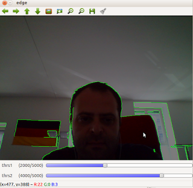

# OpenCV 2.4.1 Hareket Vektorleri, Kenarlar

OpenCV 2.4.1 Hareket Vektorleri, Kenarlar

OpenCV 2.4.1'de guzel gelismeler var; demo kodlari daha temiz. Mesela samples/python2/opt_flow.py kodu alttaki goruntuyu verir, ikinci resim edge.py orneginden. Bu kodlar, cagrilar ve onlarin geri dondurdugu veriler biraraya konarak ilginc uygulamalar gerceklestirilebilir. Mesela ilk cikti biz kafayi yana kaydirinca o hareketin vektorlerini hesapladi. Ikinci resim her karede hizli bir sekilde kenar hesaplamasi yapiyor. Bunlar biraraya konarak algilayici birlestirimi (sensor fusion) ile ekranda hareketin tetikledigi / onu baz alan obje tanimlamasi, takibi gerceklestirilebilir. Hareket vektorleri ekranda sadece belli bir bolgede var, yine ayni bolgeler icin ikinci algilayicidan kenar bilgileri geliyor...

