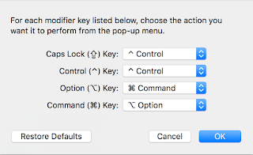

# Mac OS, Mac Book

Mac OS, Mac Book 

MacBook Pro 12,1 ile Unix'vari gelistirme yapabilmek icin, 

Caps Control yapmak icin surasi. Elma isaretinden Systems Preferences | Keyboard | Modifier Keys secilir, burada alttaki ayarlar yapilabilir,

Bu ayarlarla SPACE solundaki tus Emacs icin Alt oluyor, yani M-, CAPS yerine Ctrl oluyor, vs.

Klavyeyi US yapmak icin Elma isaretinden System Preferences | Keyboard | Input Sources, ve US.
Alt-Tab'in "sonraki pencere"ye gidebilmesi icin "next window shortcuts | keyboard | move focus to active or next window" secenegine tiklayin, ve Alt-Tab'e basin.

Emacs surada. Indirip tiklayinca kurulum olur.

En son MacOs Emacs ayarlarimiz surada.

Kopyalama ve Yapistirma (Copy ve Paste)

Ctrl-C, Ctrl-V ile bu isi yapmaya aliskin olanlar surayi takip edebilir.

Mac'te her turlu isler kod brew install ile kurulur, mesela imagemagick bu sekilde.

Pip kurmak icin: sudo easy_install pip

R

brew tap homebrew/science
brew install gcc
brew install r

MacBook'a ssh ile login etmek icin System Preferences | Sharing'e gidin ve Remove Login'i etkin hale getirin. 

Dock

Alt ortada uygulama ikonlarinin oldugu dock denen bir kisim var. Bazen uygulamalar, mesela komut satiri Python gibi, isleyince burada ziplamaya basliyorlar. Bunu kapatmak icin komut satirindan

defaults write com.apple.dock no-bouncing -bool TRUE
killall Dock

Scrollbar

Pencereleri alta yukari kaydirmak icin sagda, solda olan cubuk son MacOs'de kaldirilmis. Bunu geri almak icin System Preferences | General | Show scrollbars | Always

Latex Kurmak Icin

brew cask install mactex

ya da

TeX icin MaxTeX.pkg adli bir paket, Google'dan bulunabilir. Kurarken 'customize' secin ve ghostscript kurulusunu iptal edin (cunku bu paket ileride Octave ile cakisma yaratiyor). Kurulduktan sonra pdflatex /usr/texbin/pdflatex adresinde. Bazi ek isler, mesela minted kullanimi icin, sudo easy_install Pygments kurulmali.

